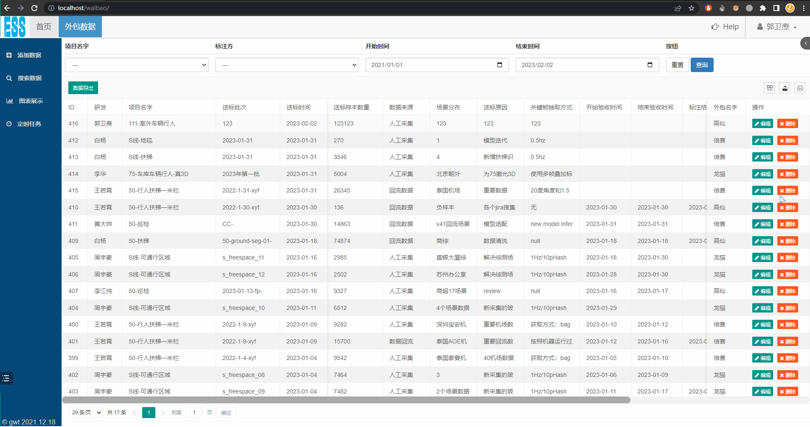
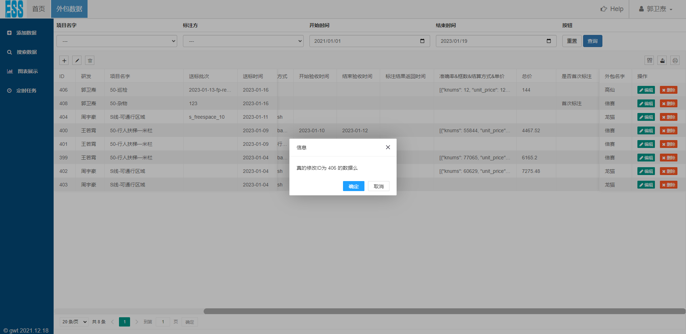
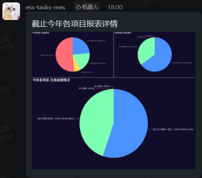
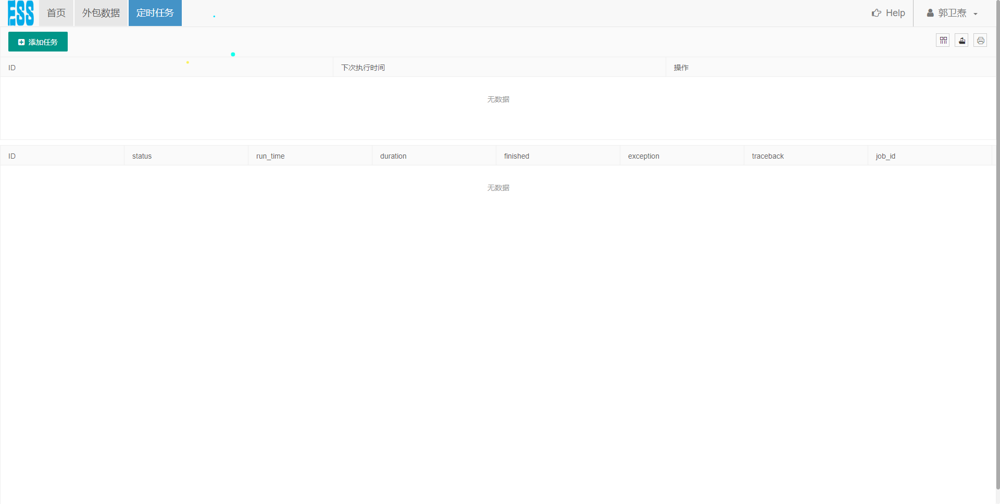
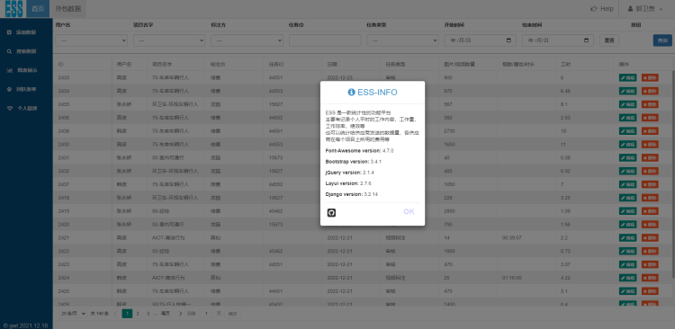
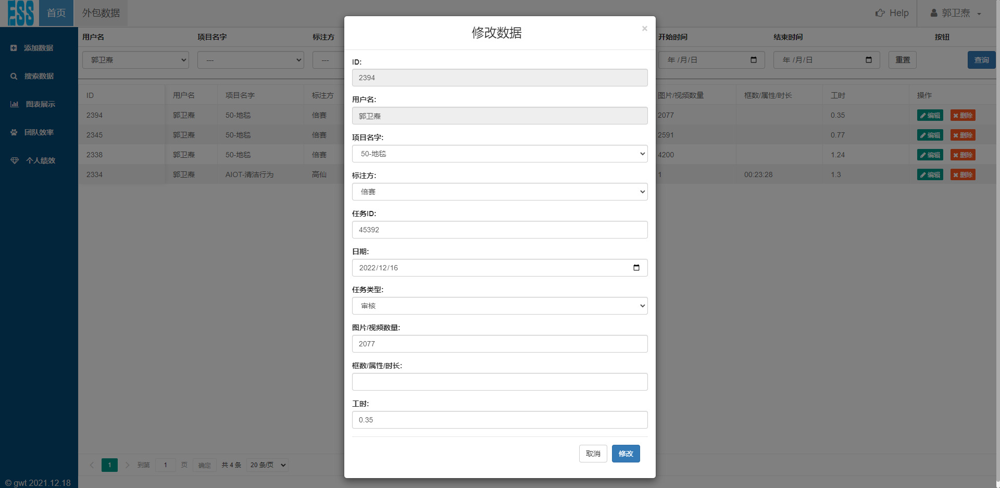

# 2023-02-02
### Changed
- 动态添加结算方式等，可删除指定行(首行除外)
- table 点击指定行，该行高亮显示

# 2023-01-31
### Added
- 用户信息新增 部门/组
### Changed
- 把原来首页中图表的展示美化
    
- 修改供应商页面表格展示样式
    - 单元格内容过多,原来需点击然后弹出内容, 现在只需鼠标滑动滑轮
    

# 2023-01-30
### Changed
- 定时任务执行时间修改
    - 每天执行改成每周执行

# 2023-01-20
### Added
- 外包栏添加当前表格中的所有数据导出功能
    - 右侧的导出为 仅导出当前页的数据

# 2023-01-19
### Added
- 添加 修改数据时 提示修改数据的ID为多少
- About 内容新增
### Changed
- 只有管理员账号才能看见 Setting
- 定时任务执行日志只展示正常执行的，异常的任务需要到后台去看
### Removed
- 取消修改密码功能

# 2023-01-18
### Added
- 图表添加搜索功能
    - 供应商
    - 时间范围
### Changed
- 完成钉钉每日自动发送本地图表功能
- 修复折线图显示不正确的问题
- 图表搜索样式调整

# 2023-01-16
### Added
- 添加 是否是首次标注

- 添加定时任务壳子，后面将设置钉钉图表每日自动发送

### Changed
- 修复 添加新数据 图表没有正常工作的bug

# 2023-01-14
### Changed
- 把原来的图表样式和逻辑做了更改

# 2023-01-13
### Changed
- 修复数据添加后，修改框数等为 None 的问题
- 修复每次修改数据后，钉钉通知用户名为该条数据记录中的用户名问题
- 添加送标批次 来方便 验收和研发 明确修改目标是哪个

# 2023-01-12
### Changed
- 将原有外包栏功能更改为数据送标统计通能

# 2023-01-05
### Changed
- 修复项目名字中有 '&' 检索不出来的问题

# 2022-12-23
### Added
- 添加 ESS INFO (用户名 --> 关于)

### Changed
- help 的弹窗改为自动消失
- 登录界面 支持 '回车键' 登录
- Admin 页面支持多条件搜索，条件与条件之间用 空格 隔开

- 修改数据不用再跳转页面

- 绩效页面展示优化

# 2022-12-22
### Changed
- 切换鼠标样式
    - 有鼠标点击效果(可以长按/拖动)
- 将内部数据和供应商数据表格换种框架展示
    - 内部数据默认只展示最近<b>一个月的数据</b>
        - 如果搜索时没填写时间，就相当于在最近<b>一个月的数据</b>中搜索
    - 供应商数据默认只展示最近<b>一年的数据</b>
        - 如果搜索时没填写时间，就相当于在最近<b>一年的数据</b>中搜索
    - 用Ajax 进行增删改查等操作，减少页面刷新
    - 表格的列宽可以自由拖动
- 权限机制
    - 1 ：管理员
    - 2 ：读、写、改
    - 3 ：读
    - 4 ：未激活

# 2022-12-12
### Changed
- 更换logo
- 几个页面稍作美化
- 注册账号/修改密码 会有邮件通知
- 添加/修改/删除数据的通知任务 放后台执行
- 将数据库密码，钉钉webhook等 通过配置文件获取

